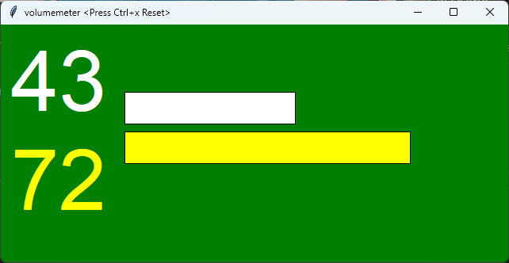
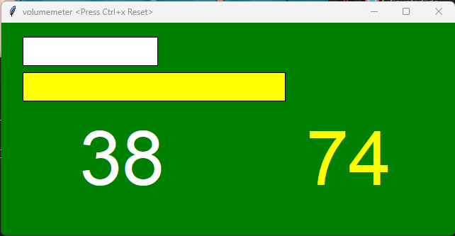

# 簡単音量可視化ツール
シンプルな音量可視化ツールです。

最大値と現在のボリュームを表示します。グリーンバックになっており、配信などでクリッピングすることが出来ます。

マイクの入力値によるため、誤差があります。



## 設定ファイル

実行ファイルと同階層に visualizer_config.yaml を置き、設定を変更するとボリュームのしきい値やインデックスが変更出来ます。

- alert: 文字が赤くなる値
- warning: 文字が黄色くなる値
- layout: 数字を音量バーの左、または下に配置するか
- mic_index: 既定のデバイスは１　既定のマイクデバイス以外を指定する場合は変更します

```
alert: 80
warning: 70
layout: "horizontal"
# layout: "vertical"

mic_index: 1
```
### horizontal


### vertical


mic_index を変更する際は、 [オーディオデバイスリスト化ツール](./bin/list_audio.exe)を使用することで、インデックスと名前が分かります。

## 操作方法
Ctrl + x で最大値をリセット出来ます。

### 開発メモ
実行ファイル化
```
pyinstaller .\main.py --name simple_volume_visualizer.exe --onefile --noconsole
pyinstaller .\list_audio.py --name list_audio.exe --onefile --noconsole
```
